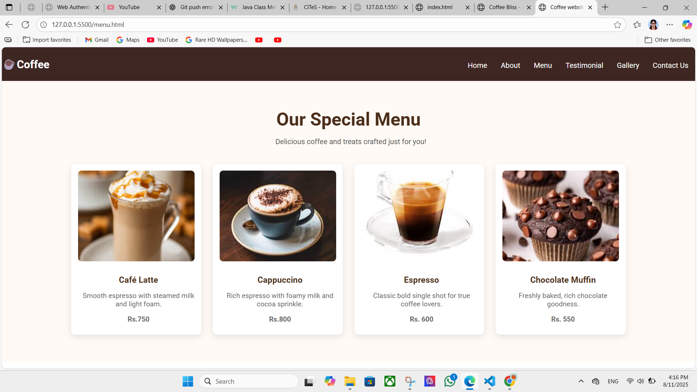
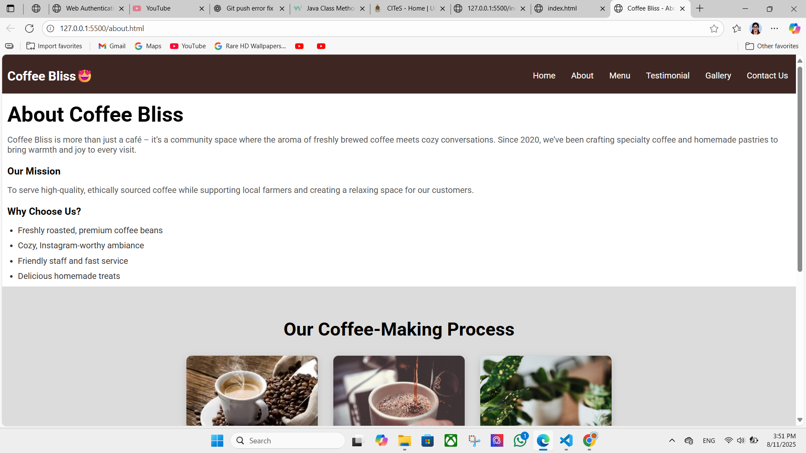

# ☕ Coffee Shop

Welcome to **Coffee Shop** – the ultimate web destination for coffee lovers!  
Discover, learn, and enjoy everything about coffee, from classic brews to modern espresso magic.

---

## 🚀 Project Overview

This project is a stylish, responsive website dedicated to showcasing the passion for coffee. Built with **HTML**, **CSS**, and a sprinkle of **JavaScript**, it delivers a visually engaging and interactive experience for users.

---

## ✨ Features

- **Beautiful Landing Page** – Welcomes users with rich visuals and inviting descriptions.
- **Menu Explorer** – Browse our curated list of coffee drinks with mouth-watering images and details.
- **About Us** – Learn the story behind our love for coffee.
- **Contact Form** – Get in touch for orders, feedback, or just to say hello!
- **Responsive Design** – Enjoy a seamless experience on desktop, tablet, or mobile.
- **Subtle Animations** – Engaging transitions and effects for a modern feel.

---

## 🛠️ Tech Stack

- **HTML5** – Semantic and accessible markup.
- **CSS3** – Custom styling with responsive layouts and animations.
- **JavaScript** – Interactive features to enhance user engagement.

---

## 📂 Project Structure

```
coffee/
├── index.html
├── about.html
├── menu.html
├── contact.html
├── css/
│   └── styles.css
├── js/
│   └── scripts.js
└── images/
    └── (coffee pics, logo, etc.)
```

---

## 🌟 Screenshots

<!-- Add your screenshots here -->



---

## 👩‍💻 Getting Started

1. **Clone the repository:**
    ```bash
    git clone https://github.com/pushmitha20/coffee.git
    ```
2. **Open `index.html` in your browser.**
3. Enjoy exploring the Coffee Shop!

---

## 🤝 Contributing

Contributions are welcome!  
Feel free to fork the repo and submit pull requests for new features, improvements, or bug fixes.

---

## 📬 Contact

- **GitHub:** [pushmitha20](https://github.com/pushmitha20)
- **Email:** vpushmitha20@gmail.com

---

## ☕ Let's Make Every Cup Count!
Happy Brewing! 🚀
